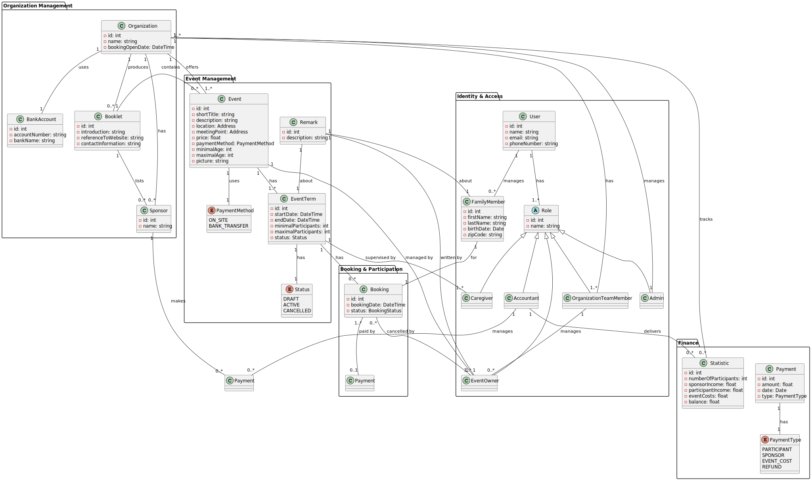

# Domain Model

This document describes the domain model for the Holiday Planner system.

---

## Key Design Decisions

### 1. Global Level vs. Organization

- **Admin** sits entirely outside any organization. Their only job is to create and manage municipal organizations.
- **Organization** is the central hub for a municipality or region. All staff, finances, and events belong to an organization. It holds high-level settings like `bankAccount` and `bookingStartTime`.
- **OrganizationTeamMember** manages day-to-day operations for a specific organization.

---

### 2. Money and Sponsors

- Every organization has at least one **Accountant** who tracks all incoming and outgoing payments via an internal balance.
- **Sponsors** are linked to an Organization (not to individual events). A sponsor has a name and an optional financial amount.

---

### 3. Users, Parents and Participants

- **User** is the account holder (usually a parent) who logs in with an email and phone number.
- The system books *participants*, not users directly. A User manages one or more **FamilyMember** records.
- If a parent wants to attend an event themselves, they add themselves as a family member.

**FamilyMember attributes:** `firstName`, `lastName`, `birthDate`, `zip`

---

### 4. Events vs. Event Terms

This is the most critical design pattern in the system:

- **Event (Template):** Holds general information that does not change between occurrences — `shortTitle`, `description`, `location`, `meetingPoint`, `price`, `paymentMethod`, `minimalAge`, `maximalAge`, optional `picture`.
- **EventTerm (Occurrence):** An Event contains one or more Event Terms. Each term holds `startDateTime`, `endDateTime`, `minParticipants`, `maxParticipants`, and a lifecycle `status`.

**EventTerm Status:**
| Status | Description |
|---|---|
| `DRAFT` | Planning phase — not visible to the public |
| `ACTIVE` | Visible and bookable |
| `CANCELLED` | Visible but not bookable |

---

### 5. Managing Events

- **EventOwner** is assigned to manage specific events. They do not have to be Org Team members, but an Org Team member can act as an Event Owner.
- **Caregiver** is assigned to event terms. Caregivers do not have system accounts — they exist as contact info only and are notified via email.

---

### 6. Bookings, Waitlist and Remarks

- **Booking** is the link between a `FamilyMember` and an `EventTerm`.

**Booking Status:**
| Status | Description |
|---|---|
| `CONFIRMED` | Participant has a place |
| `WAITLISTED` | Event is full — participant is in queue (FIFO) |
| `CANCELLED` | Booking was cancelled |

- There is **no separate WaitingList class**. The waitlist operates on a First-In-First-Out (FIFO) basis using the `WAITLISTED` booking status.
- When a confirmed booking is cancelled or max participants is increased, the first `WAITLISTED` booking is automatically promoted to `CONFIRMED`.

- **Remark** allows Event Owners to write internal notes about a participant's behaviour. Remarks are linked to the `EventOwner` who wrote it and the `FamilyMember` it describes.

---

## Entity Overview

| Entity | Belongs To | Key Attributes |
|---|---|---|
| `Organization` | — | `name`, `bankAccount`, `bookingStartTime` |
| `TeamMember` | Organization | `userId`, `firstName`, `lastName`, `email`, `role` |
| `Sponsor` | Organization | `name`, `amount` |
| `Event` | Organization | `shortTitle`, `description`, `location`, `price`, `minimalAge`, `maximalAge` |
| `EventTerm` | Event | `startDateTime`, `endDateTime`, `minParticipants`, `maxParticipants`, `status` |
| `Caregiver` | EventTerm | `firstName`, `lastName`, `email`, `phoneNumber` |
| `User` | Organization | `email`, `phoneNumber`, `passwordHash` |
| `FamilyMember` | User | `firstName`, `lastName`, `birthDate`, `zip` |
| `Booking` | FamilyMember + EventTerm | `status` (CONFIRMED / WAITLISTED / CANCELLED) |
| `Remark` | EventTerm + FamilyMember | `description`, `eventOwnerId`, `createdAt` |
| `Payment` | Booking | `amount`, `status` (PENDING / PAID / REFUNDED) |
